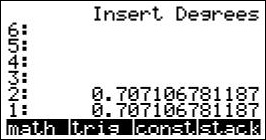
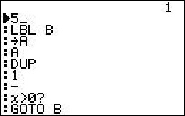

# RPN Stack for Casio Algebra FX 2.0+ graphing calculator 
This is an RPN stack for the Algebra FX 2.0+ with simple keystroke programming. The functionality is similar to a Hewlett-Packard RPN calculator.

